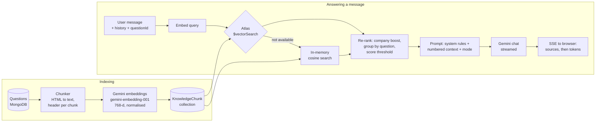

# Company Prep Hub

A MERN platform that collects real online-assessment (OA) and interview questions by company, with **PrepPilot**, an AI interview coach built on a **RAG (retrieval-augmented generation) pipeline**. PrepPilot answers questions like *"What does Amazon ask in their OA?"* using the actual question bank, cites the questions it used, and coaches you on a specific problem with hints, full solutions, likely follow-ups, or a mock interview.

**Live demo**

- Website: https://company-prep-hub.onrender.com
- API: https://company-prep-hub-api.onrender.com ([health check](https://company-prep-hub-api.onrender.com/api/health))

---

## Features

- **Question bank by company**: search by title or company, browse by company, view full problem statements with constraints and examples.
- **PrepPilot AI coach** (site-wide): ask about companies, topics or study plans. Answers are grounded in retrieved questions and cite them inline (`[1]`, `[2]`), linking straight to the question.
- **Question-aware coaching** (on every question page):
  - *Give me a hint*: progressive hints that never reveal the full answer
  - *Walk me through the solution*: brute force, key insight, dry run, complexity, code
  - *What follow-ups might they ask?*: variants and edge cases interviewers push on
  - *Mock interview me*: PrepPilot plays the interviewer until you end the session
- **Real-time streaming**: answers stream token by token over Server-Sent Events.
- **Context-aware**: uses the question you're viewing, company names you mention, and your previous messages for follow-ups like *"and its complexity?"*.
- Email/password auth (bcrypt) and Google sign-in.

## How the RAG pipeline works



1. **Chunking** (`backend/rag/chunker.js`): each question becomes plain text (HTML stripped) with a header of title, companies, difficulty and topics. Long statements split into ~1,800-character chunks with overlap, and every chunk keeps the header so it's meaningful on its own.
2. **Embedding and storage** (`backend/rag/indexer.js`): chunks are embedded with Gemini `gemini-embedding-001` (task type `RETRIEVAL_DOCUMENT`, 768 dimensions) and stored in a `knowledgechunks` collection. Each chunk stores a content hash, so re-indexing only re-embeds new or changed questions. Indexing runs automatically on server start and whenever a question is added.
3. **Retrieval** (`backend/rag/retriever.js`, `vectorStore.js`): the message (plus the previous user turn, for follow-ups) is embedded as `RETRIEVAL_QUERY`. Search uses **MongoDB Atlas Vector Search** (`$vectorSearch`; the index is created automatically) and falls back to an in-memory cosine-similarity scan on any MongoDB without Atlas Search. Company names in the message trigger a filtered search and a small score boost. Hits are grouped by question, thresholded, and the question you're viewing is always placed first. If embedding fails, a keyword search keeps the assistant working.
4. **Generation** (`backend/rag/prompts.js`, `gemini.js`): retrieved questions go into a numbered `<context>` block with rules to cite them and never invent what a company asked. The answer streams from Gemini (`gemini-3.8-flash`, falling back to `gemini-3.5-flash-lite` if rate-limited or unavailable) and is forwarded over SSE: first the sources, then the text.

Guardrails: input validation, per-IP rate limiting on the AI endpoint, an admin key on re-indexing, and the password hash is never returned by the API.

## Tech stack

| Layer | Tech |
| --- | --- |
| Frontend | React 18, Vite, React Router, React Bootstrap, react-markdown |
| Backend | Node.js, Express, Mongoose |
| Database | MongoDB Atlas (with Atlas Vector Search) |
| AI | Google Gemini API: `gemini-embedding-001` embeddings, Gemini Flash for generation |
| Hosting | Vercel (frontend), Render (backend) |

## Project structure

```
backend/
  server.js            Express app and question/auth routes
  routes/ai.js         /api/ai/status, /api/ai/chat (SSE), /api/ai/reindex
  rag/                 chunker, gemini client, indexer, vectorStore, retriever, prompts, rateLimit
  Models/              Question, User, KnowledgeChunk
  scripts/index.js     CLI: embed all questions
  scripts/seed.js      CLI: add or remove sample questions
  data/                sample questions and seeding
  tests/               node:test suite (mocked Gemini + in-memory DB)
frontend/
  src/components/ai/   PrepPilot UI: AIAssistant, PrepCoach, ChatPanel, Markdown, useChat
  src/lib/aiClient.js  SSE client for the chat endpoint
  src/config.js        API base URL (VITE_API_URL)
render.yaml            Render Blueprint for the backend
```

## API

| Method | Endpoint | Description |
| --- | --- | --- |
| GET | `/api/health` | Health check (DB and AI status) |
| GET | `/api/questions?search=` | All questions, or prefix search on title/company |
| GET | `/api/questions/:id` | One question |
| GET | `/api/questions/company/:name` | Questions for a company |
| POST | `/api/questions/add` | Add a question (embedded automatically) |
| POST | `/api/signup`, `/api/login` | Auth |
| GET | `/api/ai/status` | Whether AI is configured, index size, search mode, top companies |
| POST | `/api/ai/chat` | `{ message, history?, questionId?, mode? }` → SSE stream of `sources`, `token`, `done`/`error` events. Modes: `chat`, `hint`, `approach`, `followups`, `interview` |
| POST | `/api/ai/reindex` | Re-embed questions. Header `x-admin-key: <ADMIN_KEY>`; body `{ "force": true }` re-embeds everything |

## Run locally

Requirements: Node.js 18.17+ (22 recommended), a MongoDB connection string, and a free Gemini API key from [Google AI Studio](https://aistudio.google.com/apikey).

```bash
# Backend
cd backend
cp .env.example .env      # fill in MONGODB_URL, GEMINI_API_KEY, ADMIN_KEY
npm install
npm run dev               # http://localhost:4000, embeds questions on startup

# Frontend (new terminal)
cd frontend
cp .env.example .env      # VITE_API_URL=http://localhost:4000
npm install
npm run dev               # http://localhost:5173
```

To embed everything manually: `cd backend && npm run index` (add `-- --force` to re-embed all).

### Sample data

When the server starts with no real questions in the `questions` collection, it loads 60 sample OA-style questions (classic problems written for this project, tagged with the 30 companies in the sidebar, 4 to 9 per company) so the site and PrepPilot work immediately. Samples added to `backend/data/sampleQuestions.js` later are picked up on the next start. As soon as the database holds any question that isn't a sample, automatic seeding stops, so samples are never mixed into real data.

- Add the samples manually: `npm run seed`
- Remove them once you have real questions: `npm run seed -- --remove`
- Turn off automatic seeding: set `SEED_SAMPLE_DATA=false`

Tests: `cd backend && npm test`

### Environment variables

**Backend** (`backend/.env` or Render)

| Variable | Required | Description |
| --- | --- | --- |
| `MONGODB_URL` | yes | MongoDB connection string |
| `GEMINI_API_KEY` | yes | Gemini API key |
| `ADMIN_KEY` | yes | Secret for `POST /api/ai/reindex` |
| `CORS_ORIGIN` | no | Comma-separated allowed origins (default: all) |
| `GEMINI_CHAT_MODELS` | no | Default `gemini-3.8-flash,gemini-3.5-flash-lite` |
| `GEMINI_EMBED_MODEL` / `GEMINI_EMBED_DIMS` | no | Default `gemini-embedding-001` / `768` |
| `AI_RATE_LIMIT` | no | AI requests per IP per 15 minutes (default 30) |
| `AUTO_INDEX` | no | `false` to skip embedding on startup |
| `SEED_SAMPLE_DATA` | no | `false` to skip loading sample questions on startup |

**Frontend** (`frontend/.env` or Vercel)

| Variable | Description |
| --- | --- |
| `VITE_API_URL` | Backend URL, e.g. `https://company-prep-hub-api.onrender.com` |
| `VITE_GOOGLE_CLIENT_ID` | Google OAuth client ID for Google sign-in |

## Deploy

### Backend on Render

1. Click **[Deploy to Render](https://render.com/deploy?repo=https://github.com/palsumang56-boop/Company-Prep-Hub)**. It reads `render.yaml` and creates a free web service from `backend/`.
2. When asked, paste `MONGODB_URL` and `GEMINI_API_KEY`. `ADMIN_KEY` is generated for you.
3. In MongoDB Atlas, open **Network Access** and allow `0.0.0.0/0` (Render's free plan has no fixed IPs).
4. Once live, `https://<service>.onrender.com/api/health` should show `"db":"connected","ai":true`. Questions are embedded automatically on first start.

The free plan sleeps after 15 minutes of inactivity, so the first request after a pause takes up to a minute. The UI shows a notice while it wakes.

### Frontend on Render (static site)

Build command `cd frontend && npm ci && npm run build`, publish directory `frontend/dist`, and environment variables `VITE_API_URL` and `VITE_HASH_ROUTER=true`. Hash routing keeps deep links working after a refresh; alternatively, add a Rewrite rule `/*` → `/index.html` in the site's Redirects/Rewrites settings and drop `VITE_HASH_ROUTER`.

### Frontend on Vercel

1. On [vercel.com/new](https://vercel.com/new), import this repo.
2. Set **Root Directory** to `frontend` (framework preset: Vite).
3. Add environment variables `VITE_API_URL` (your Render URL) and `VITE_GOOGLE_CLIENT_ID`, then deploy.
4. For Google sign-in, add the Vercel URL to **Authorized JavaScript origins** of your OAuth client in Google Cloud Console.

### Atlas Vector Search

On MongoDB Atlas (including the free M0 tier) the backend creates a vector search index named `vector_index` on `knowledgechunks` automatically. It takes about a minute to build; until then, and on non-Atlas MongoDB, search falls back to in-memory cosine similarity. `GET /api/ai/status` shows which mode is active.
